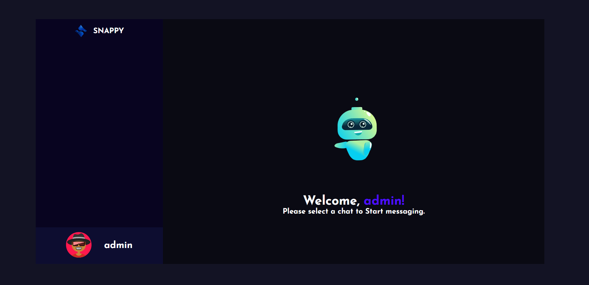

# Snappy - Real-Time Chat Application

A real-time chat application built with the MERN stack and Socket.IO. Users can register, choose an avatar, and chat instantly with other users, with conversations saved in MongoDB.

🔗 **Live Demo:** [chat-app-4h6f.vercel.app](chat-app-4h6f.vercel.app)

> Hosted on a free tier, so the first load may take up to a minute.

## Screenshots

| Login | Chat |
|---|---|
|  |  |

## Features

- User registration and login
- Avatar selection
- Contact list of registered users
- Real-time messaging using WebSockets (Socket.IO)
- Message history stored in MongoDB, so chats reload after logging in again
- Docker Compose support for running the frontend and backend together

## Tech Stack

- **Frontend:** React.js
- **Backend:** Node.js, Express.js, Socket.IO
- **Database:** MongoDB
- **DevOps:** Docker, Docker Compose

## Run Locally

### Requirements
- [Node.js](https://nodejs.org/en/download)
- [MongoDB](https://www.mongodb.com/docs/manual/administration/install-community/), running locally

### Without Docker

```shell
git clone https://github.com/anshu6646/Chat-app.git
cd Chat-app
```

Rename the env files:

```shell
cd public && mv .env.example .env && cd ..
cd server && mv .env.example .env && cd ..
```

Start the backend:

```shell
cd server
yarn
yarn start
```

In a second terminal, start the frontend:

```shell
cd public
yarn
yarn start
```

Open `http://localhost:3000` in your browser.

### With Docker

```shell
docker compose build --no-cache
docker compose up
```

Open `http://localhost:3000` in your browser.
